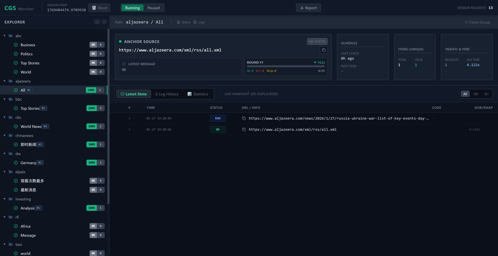

# IntelligenceCrawler

The submodule of IntelligenceIntegrationSystem which has been separated into a separate project.


# 前言

如果没有足够的技术能力和时间精力，不要自己搞爬虫，真的。

因为当你做的时候，你才发现爬虫并非“提取网页内容”这么简单。因为不同网页有不同的内容定位方式、内容提取方式、额外的自动化操作，等等。 
一旦网页做出调整，你就不得不跟进修改你的抓取方式。

你很快会发现，网页抓取大部分步骤相同。为了减少工作量，你会开始基于你当前的认知设计一个爬虫框架。至此你终于踏入这个大坑。
因为你抽取共同的步骤并封装后，随着更多的网站的接入，你会发现不同网站的差异很有可能超过你最初的设计，因此框架会变得越来越复杂。

而且除了抓取功能外，你还需要一个强大的监控功能。因为你需要及时发现抓取失败的情况并调整，同时抓取效率的统计也很重要（接下来优化又是一个坑）。
怎样设计统计信息、怎样把这个统计功能嵌入抓取框架，都是头疼的问题。

正因如此，我的爬虫从(IIS](https://github.com/SleepySoft/IntelligenceIntegrationSystem)系统中的几个文件，逐渐演变成了这一个独立且复杂的项目。

而我所期望的，无外乎持续地获取目标网页特定内容分类下的文本和元数据。如果有现成的服务而且代价合理，我就可以废弃这个项目了。

# 理念

这个工具原本是[IIS](https://github.com/SleepySoft/IntelligenceIntegrationSystem)系统的一部分，也就是说，它最初的设计目标就是针对新闻进行抓取，并提取为纯文本。
因此：

1. 本框架基于“列表”抓取文章内容，这个“列表”可以是RSS，也可以是SiteMap，或者是文章列表页。它不会像spider一样遍历链接爬取整个网站。
2. 本框架致力于以及纯文本的方式准确提取正文，并得到文章的元数据。不支持图片或多媒体的提取。

如果你需要的是spider或多媒体信息抓取，请寻求其它更合适的工具。


# 设计


## 组件

爬虫的组件分为

+ 抓取器[Fetcher.py](Fetcher.py)
> 通过网络请求获取网页内容，包含浏览器伪装和页面渲染。

+ 发现器[Discoverer.py](Discoverer.py)
> 分析RSS、SiteMap或文章列表，解析其中包含的需抓取的文章目录。

+ 提取器[Extractor.py](Extractor.py)
> 从抓取的网页网容中提取正文和元数据，结果以纯文本的形式返回（元数据为dict）。

其中发现器和提取器都需要发现器获取网络内容。详细信息请参考[这篇文章](https://zhuanlan.zhihu.com/p/1969809080475444030)。


## 监控工具

为了实时监控爬虫状态，项目中还包含了与具体爬虫框架无关的，基于网页的监控工具。

也就是说，即使你不使用本爬虫框架，也可以使用这一套监控工具。



该工具包含以下三个文件：

+ [CrawlerGovernanceCore.py](CrawlerGovernanceCore.py)

+ [CrawlerGovernanceBackend.py](CrawlerGovernanceBackend.py)

+ [crawler_governance_frontend.html](crawler_governance_frontend.html)

使用方法如下：

```python
from IntelligenceCrawler.CrawlerGovernanceCore import GovernanceManager
from IntelligenceCrawler.CrawlerGovernanceBackend import CrawlerGovernanceBackend

# 创建实例，一个进程只需要创建一个，它会独占属于它的db文件。
crawler_governor = GovernanceManager(
    db_path='spider_governance.db',
    files_path='spider_governance_files'
)

channel_url = 'https://rss.feed'    # 可以为分组指定它的列表页，点击该分组时即可看到该列表页的抓取统计
channel_group = 'site1/group2'      # 或 ['site1', 'group2']

# 注册一个“组”，最终形成监控网页中的树形分组。
crawler_governor.register_group_metadata(channel_group, channel_url)

article_urls = ['抓取的文章列表，通常从channel中获取']

# 可选：记录新的一轮抓取开始，可在网页上显示一轮抓取的进度。
crawler_governor.start_round(channel_group, len(article_urls))

for article_url in article_urls:

    # 判断是否应该抓取（对于非group url，成功或永久错误后则不再抓取）
    if not crawler_governor.should_crawl(article_url):
        continue
        
    # 开始一次抓取
    with crawler_governor.transaction(channel_url, channel_group) as task:
        try:
            # TODO: 抓取操作
            success = True

            if success:
                task.success(state_msg='成功')
            else:
                task.fail_temp(state_msg="临时错误")
                
        except Exception as e:
            task.fail_perm(state_msg="永久错误，不再尝试抓取")

    # 可选：记录一轮结束，网页会显示本轮次的统计信息
    crawler_governor.finish_round(channel_group)
```


为了方便地组合爬虫组件，并通过可视化的尝试调整抓取参数。于是


